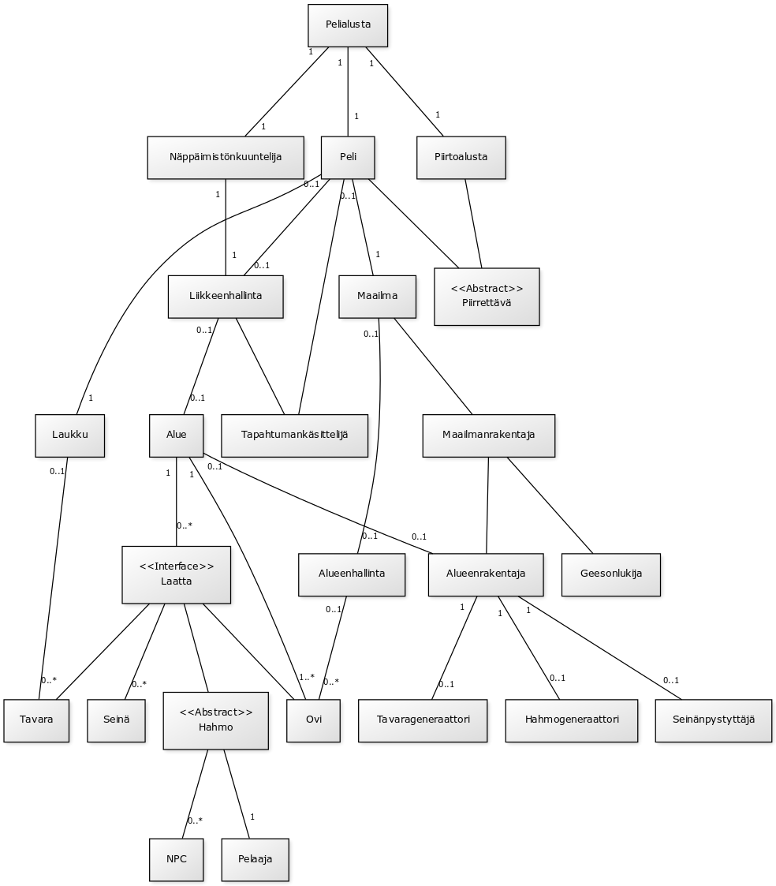
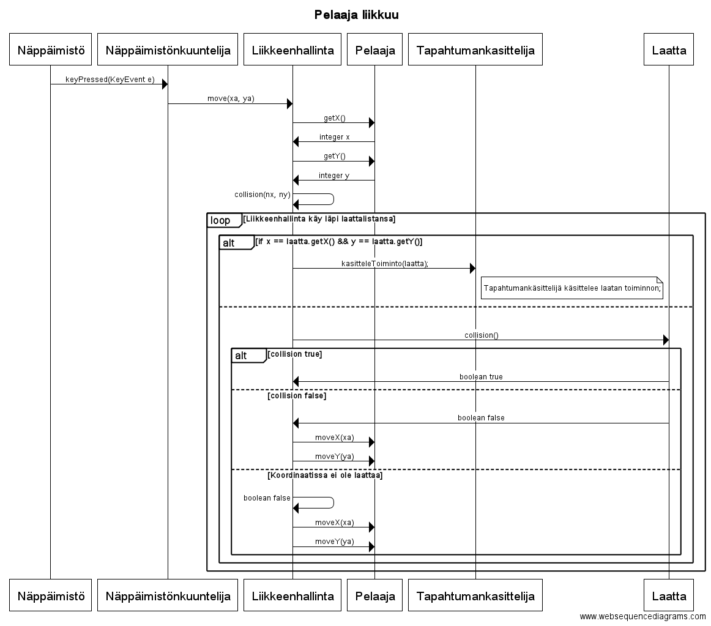
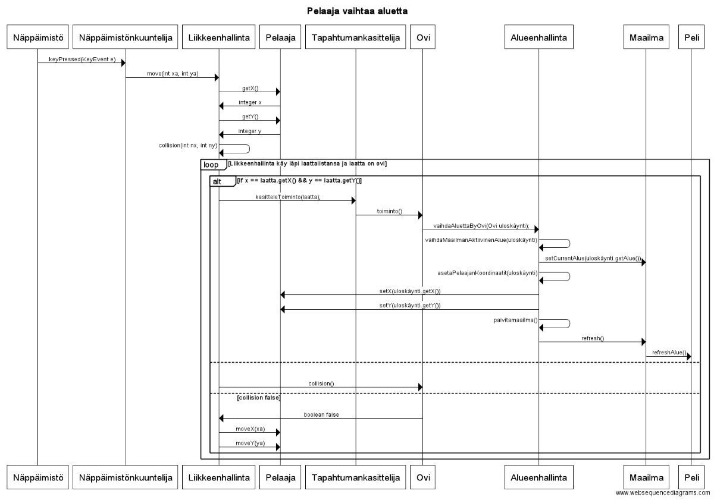

## fuk-roglyk seikkailupeli

###Aihe:

Toteutetaan pienimuotoinen seikkailupeli.

Pelissä tavoitteena on tutustua tavernan värikkäisiin hahmoihin ja suorittaa
heidän puolestaan pienimuotoisia tehtäviä pelin maailmassa liikkuen.

Pelin toteutustavoitteena on luoda riittävän kokoinen maailmakehys ja pelaajan siinä liikkuminen sekä toimiva inventaariojärjestelmä, keskusteluinteraktiot sekä mahdolliset tehtävänantointeraktiot pelaajan ja pelin hahmojen välille.

###Käyttäjät:

Pelaaja

###Kaikkien käyttäjien toiminnot:

- Maailmassa liikkuminen
- Pelin hahmojen kanssa vuorovaikuttaminen
- Pelissä olevien poimittavien esineiden poimiminen

###Luokkakaavio (Deadline 6):

###Sekvenssikaaviot (Deadline 6):

###Rakennekuvaus

Pelissä on pelaaja, laukku, maailma, liikkeenhallinta sekä tapahtumankäsittelijä. 

Maailma koostuu alueista, joissa on laattoja. 

Maailmalla on myös maailmanrakentaja, joka tiedostoista luettuja alueenrakentajia ja alueenrakentajan tuntemia generaattoreita käyttäen pelin käynnistyessä luo maailman alueet ja niiden sisällön. 

Pelatessa peliä näppäimistönkuuntelija ottaa näppäinkomentoja vastaan ja lähettää niiden tiedon liikkeenhallinnalle. 

Liikkeenhallinta tuntee pelin aktiivisen alueen ja sen laatat. 

Liikkeenhallinnan löytäessä laatan jolle pelaaja haluaa liikkua, lähettää liikkeenhallinta tapahtumankäsittelijälle käskyn käsitellä laatan tapahtuma. 

Tapahtumankäsittelijä tuntee vain laatan, jonka liikkeenhallinta antaa sille käsiteltäväksi sillä hetkellä. 

Jos laatta on tavara, käskee tapahtumankäsittelijä peliä lisäämään tavaran pelaajan laukkuun.

Jos laatta on ovi, käskee tapahtumankäsittelijä ovea suorittamaan toimintonsa. 

Ovi tuntee alueensa ja uloskäyntinsä sekä alueenhallinnan.

Ovi lähettää alueenhallinnalle uloskäyntinsä, ja alueenhallinta vaihtaa pelin ja maailman aktiivisen alueen sille annetun
oven alueeksi.
