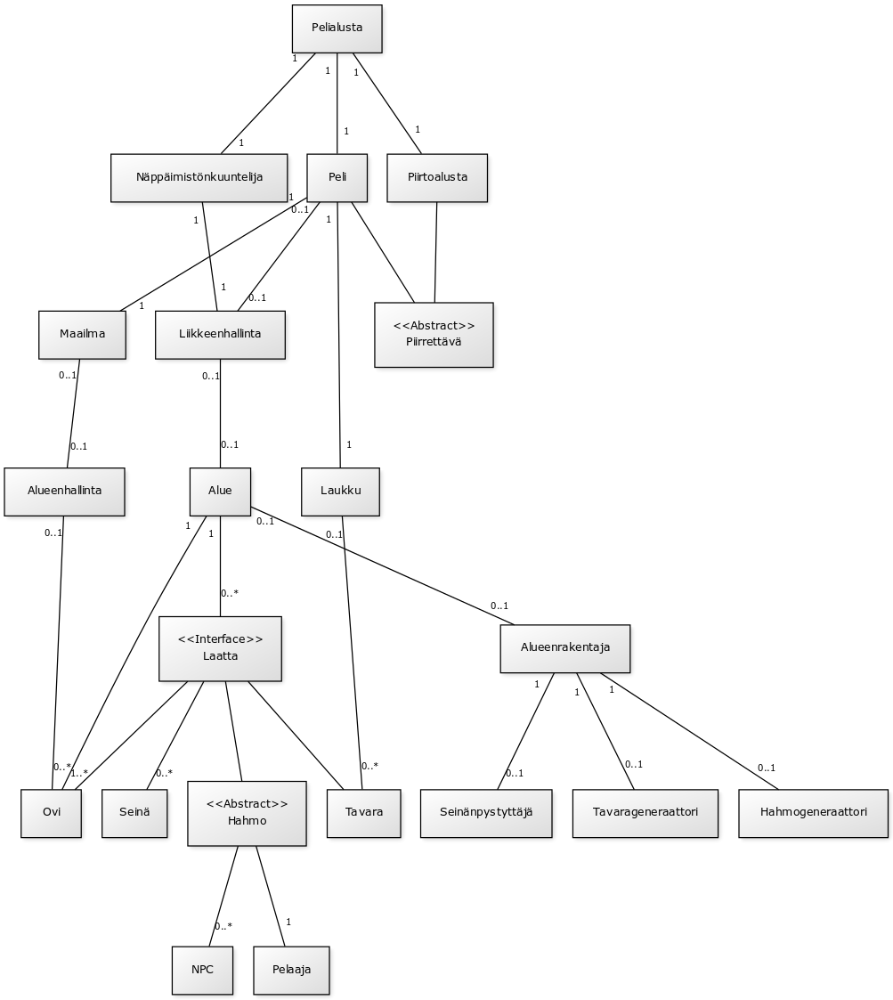

## fuk-roglyk seikkailupeli

###Aihe:

Toteutetaan pienimuotoinen seikkailupeli.

Pelissä tavoitteena on tutustua tavernan värikkäisiin hahmoihin ja suorittaa
heidän puolestaan pienimuotoisia tehtäviä pelin maailmassa liikkuen.

Pelin toteutustavoitteena on luoda riittävän kokoinen maailmakehys ja pelaajan siinä liikkuminen sekä toimiva inventaariojärjestelmä, keskusteluinteraktiot sekä mahdolliset tehtävänantointeraktiot pelaajan ja pelin hahmojen välille.

###Käyttäjät:

Pelaaja

###Kaikkien käyttäjien toiminnot:

- Maailmassa liikkuminen
- Pelin hahmojen kanssa vuorovaikuttaminen
- Pelissä olevien poimittavien esineiden poimiminen

###Luokkakaavio (Deadline 5):

